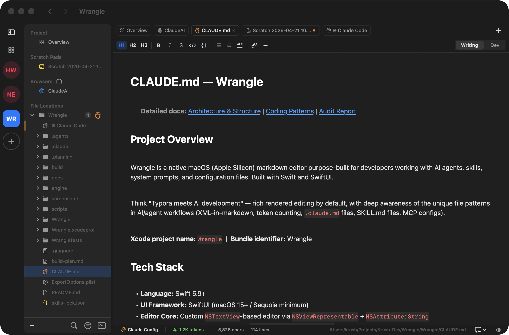
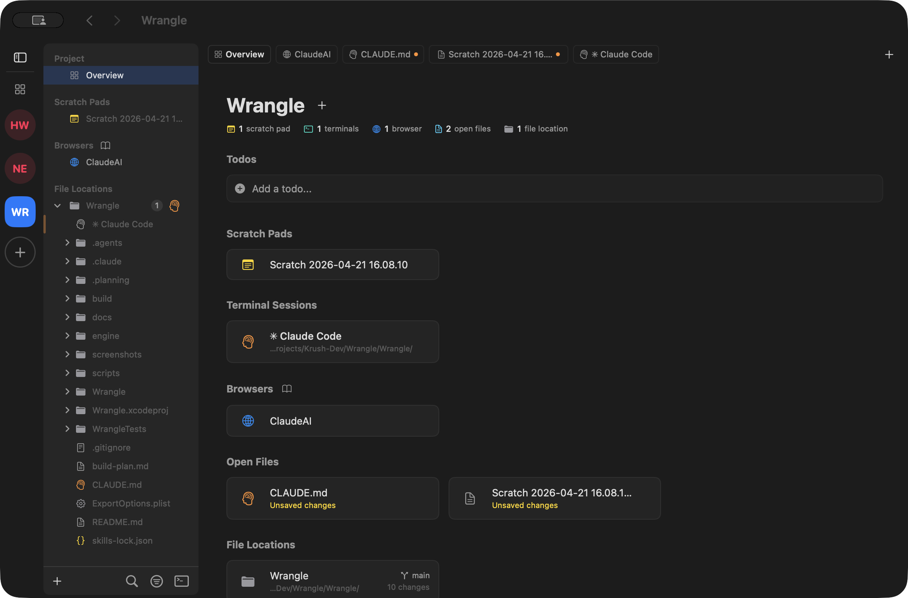
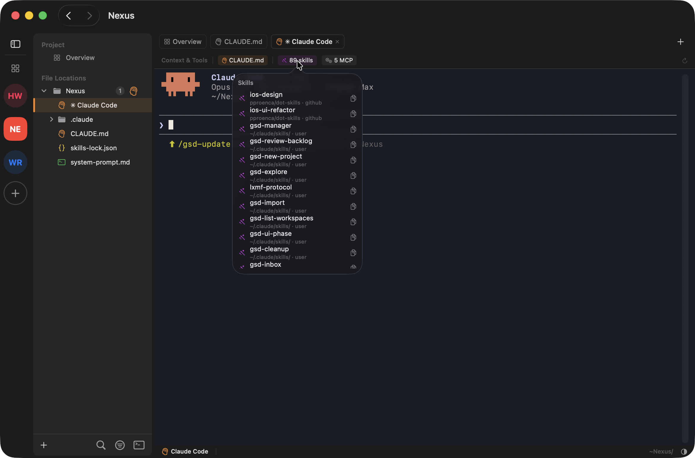
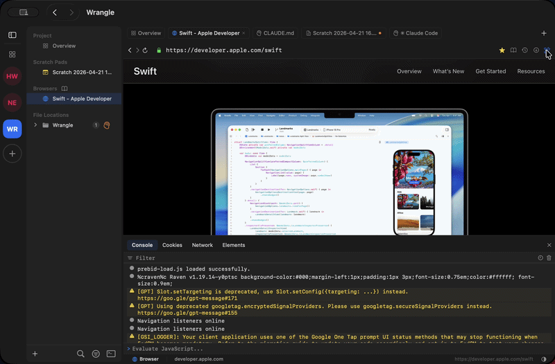
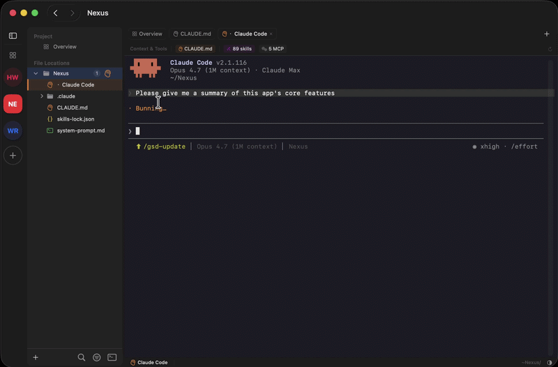

# Wrangle

A native macOS markdown editor purpose-built for developers working with AI agents — inline rendering as you type, XML-tag awareness, an embedded terminal, and first-class treatment of the file patterns that show up in AI workflows (`CLAUDE.md`, `SKILL.md`, system prompts, MCP configs).



## What this is

Wrangle is a native macOS editor for the markdown that lives inside an AI-driven development workflow.

Instead of a split preview pane, formatting renders in-place as you type — headings scale, code blocks highlight, lists indent, XML tags color — while the underlying file stays plain `.md` on disk. It is a file editor, not a note-taking app, and it is built for developers who spend their day editing `CLAUDE.md`, `SKILL.md`, `AGENTS.md`, system prompts, and configuration files.

The editor knows what an AI-prompt file looks like. `<tools>`, `<instructions>`, and `<system>` blocks are first-class — color-coded, collapsible, distinct from the surrounding prose. Token counts sit in the status bar so a prompt file's size relative to a context window is always visible. AI-specific filenames get distinct icons in the file tree.

An embedded SwiftTerm terminal lets you launch a Claude Code or Gemini session without leaving the window.

A `Cmd+P` fuzzy finder reaches across every bookmarked project.

A built-in WKWebView browser tab is one shortcut away when a workflow needs a docs lookup mid-edit — with bookmark import from Safari / Brave / Chrome / Firefox, browsing history, downloads, and a private-tab mode for when you need an isolated session.

The thesis is narrow on purpose: a markdown editor that treats the AI developer as the primary user, not a footnote on top of a general-purpose writing tool.

A workspace in Wrangle is organized around the idea of a **Project** — a top-level container that owns its own bookmarked directories, terminal sessions, browser tabs, and todos. One Wrangle window holds one Project. Open another window to switch context. Bookmarks use security-scoped persistence, so directory access survives quits and reboots without re-prompting.

### A workflow snapshot

A typical session: open a Project, see the file tree on the left with `CLAUDE.md` and `SKILL.md` files flagged with distinct icons. Open one — formatting renders inline; `<tools>` and `<instructions>` blocks are syntax-highlighted and collapsible; the token count in the status bar updates as you type. Hit `Cmd+T` to spawn a terminal tab and run `claude` against the file you just edited. Hit `Cmd+T` again to spawn a browser tab and look up an API spec without leaving the window. Bookmark the docs page so it's one click away next time.

That whole loop is the design target. Every surface — editor, terminal, file tree, browser — serves a developer driving AI agents. Speed, density, and AI-file awareness win over breadth of consumer features.

### Key features

- **Inline markdown rendering** — Rich formatting displayed as you type, raw syntax revealed at the cursor
- **XML-in-markdown highlighting** — First-class rendering for `<tools>`, `<instructions>`, and other XML tags common in AI prompts
- **Embedded terminal** — Full terminal via SwiftTerm, launch shells or Claude Code sessions without leaving the editor
- **Token counting** — Approximate token counts in the status bar for prompt files
- **Fuzzy finder** — `Cmd+P` to quickly open any file across all bookmarked projects
- **File tree with bookmarks** — Bookmark directories for fast access with security-scoped persistence
- **AI file recognition** — Distinct icons and behavior for `CLAUDE.md`, `SKILL.md`, `AGENTS.md`, and system prompt files

### What's intentionally not in scope

- **iOS / iPadOS.** macOS only. Apple Silicon primary; Intel Macs are not a supported target.
- **Document-based app template.** `NSDocument` is not used; Wrangle manages files directly so the editor model can stay tuned to AI-prompt files.
- **WebExtension API in the browser tab.** WKWebView doesn't support it, and a developer-driving-AI-agents workflow doesn't depend on browser extensions.
- **Multi-account / cross-device sync.** Bookmarks, history, and downloads are local SwiftData only.
- **Source-available or non-commercial licensing.** MIT picked deliberately — recognizable, zero friction, no commercial-use gate.

### Highlights from recent releases

- **v1.2 — Browser support.** A built-in WKWebView browser tab, with `Cmd+T` to spawn, bookmark import from Safari / Brave / Chrome / Firefox, browsing history, download tracking, private tabs, and `Cmd+Opt+I/J/C` dev-tools shortcuts.
- **v1.2 — Sidebar polish.** Static section headers with always-rendered content (no chevron, no expansion state) for sidebar density; collapsible Project Overview cards with per-project persistence.
- **v1.2 — Per-project todos.** `TodoItem` SwiftData model surfaced in the sidebar, scoped to the current Project.
- **v1.3 — Open source release.** This release. License flip to MIT, repo OSS surface, signed-DMG release pipeline, landing-page repositioning. All scoped and tracked under `.planning/phases/13-app-de-commercialization/` through `.planning/phases/18-public-flip/`.

### How this project is planned

This repo ships with its own structured planning history under [`.planning/`](.planning/) — every phase, requirement, decision, and summary that produced the code you see in `wrangle/`.

The OSS pivot itself was scoped and decided across `.planning/phases/13-app-de-commercialization/` and `.planning/phases/14-app-repo-oss-surface/`, with the trade-offs and discarded options preserved alongside the chosen path. Story-voice decisions, screenshot mappings, redaction rules, secrets-sweep results — all of it is captured in the per-phase CONTEXT, PLAN, and SUMMARY documents rather than scrubbed away after the fact.

Think of it as a product demo of GSD-style structured planning for AI-driven development workflows — visible end to end, no after-the-fact narrative cleanup.



## Why it's free and open source now

Wrangle started as a paid product.

It launched on Product Hunt on **2026-04-22** with the thesis that a native macOS editor purpose-built for AI prompt files would find an audience of developers who were already living in `CLAUDE.md` and system prompts every day. The thesis was right about the audience — the people who tried it understood the value immediately, and a small group of paid users stuck around. The product worked.

The harder part turned out to be everything around the product. The Product Hunt launch underperformed against the kind of attention required to seed a long-tail of organic word-of-mouth. A follow-up Reddit ads channel experiment did not convert at a rate that made sustained paid distribution viable. The recurring lesson sitting under both was the same: building a focused tool for a niche-but-real audience is one problem; reaching that audience reliably enough to support continued development is a different and much larger one — **distribution is harder than product**.

Converting Wrangle to MIT and reframing it as a portfolio piece is the response to that lesson.

As an open source project the tool gets to find its right users organically — through GitHub search, repo references in AI-workflow tooling threads, and the kind of word-of-mouth that doesn't depend on a paid acquisition funnel. The product keeps living; the maintainer stops having to be a full-time marketer for it.

The codebase, the planning history, and the release process are all on display, which is the point: this is a portfolio piece as much as it is a tool. If a developer reading this README ends up using Wrangle in their daily AI workflow, great. If a reviewer reading this README ends up understanding how the project was built and decided, equally great. Both are reasons to keep the repo public, well-structured, and honest about the history that led here.



## Built with

- **Swift 5.9+** and **SwiftUI** (`@Observable` + `@MainActor` everywhere)
- **SwiftData** for bookmarks, recent files, browser history, and preferences
- **[SwiftTerm](https://github.com/migueldeicaza/SwiftTerm)** (`LocalProcessTerminalView`) for the embedded terminal
- **WKWebView** for the browser tab feature
- Custom **`NSTextView`**-based editor core via `NSViewRepresentable` + `NSAttributedString` — full control over attributed-string rendering, keyboard shortcuts, and cursor behavior
- **macOS 15+ (Sequoia)** minimum, **Apple Silicon** (arm64) primary target

The architecture is MVVM with `@Observable` view-model classes (all `@MainActor`), DI via `@Environment(AppState.self)` and `@FocusedValue(\.appState)`, and Swift modern concurrency throughout (`async/await`, Task-based debouncing, no GCD unless required by a system API). The Xcode project uses `fileSystemSynchronizedRootGroup`, so every `.swift` file under `wrangle/` auto-compiles without per-file project-member edits.

The deeper guidelines live in [docs/architecture.md](docs/architecture.md) and [docs/coding-patterns.md](docs/coding-patterns.md). Contributors should read both before sending non-trivial PRs.



## Install

Download the latest signed DMG from [Releases](https://github.com/J-Krush/wrangle/releases/latest).

Open the DMG, drag Wrangle into Applications, launch. macOS 15 (Sequoia) or later, Apple Silicon.

> **Note:** The DMG download link goes live with the `v1.3.0` GitHub Release published in Phase 18 of the OSS conversion. Until then, the release is drafted on a private repo; once published, the `releases/latest` link resolves automatically to a signed, notarized installer.

## Build from source

Requirements: Xcode 16+, macOS 15 (Sequoia) or later, Apple Silicon.

```bash
git clone https://github.com/J-Krush/wrangle.git
cd wrangle
open Wrangle.xcodeproj
# Cmd+R to build & run
```

SwiftTerm is resolved automatically via Swift Package Manager on first build — no manual dependency setup required.

### First-build notes

- **App Sandbox is intentionally disabled.** This is required for the embedded terminal to launch child processes (shells, `claude`, `gemini`, etc.). The bundle is otherwise signed with a Developer ID for distribution; the signed DMG produced by the release pipeline is notarized and stapled before shipping.
- **Signing for local development.** Xcode picks up your default development team automatically. If you don't have a Developer ID, the app still builds and runs locally under an ad-hoc signature; you just can't redistribute that build.
- **First-launch directory bookmark.** On first launch Wrangle prompts for a directory bookmark via `NSOpenPanel`. Grant access to a folder you actually work in — the security-scoped bookmark is persisted via SwiftData and used to re-acquire access on subsequent launches.
- **Optional: Full Disk Access.** The Safari bookmark importer reads `~/Library/Safari/Bookmarks.plist`, which is TCC-protected. macOS will prompt for Full Disk Access the first time you run the importer; grant it via System Settings → Privacy & Security → Full Disk Access if you want Safari imports to work.

### Working on the codebase

[docs/architecture.md](docs/architecture.md) covers the SwiftUI + AppKit + NSTextView hybrid editor core, the SwiftData persistence layer, and the SwiftTerm embed.

[docs/coding-patterns.md](docs/coding-patterns.md) documents the modern-concurrency conventions and the cache-regex-as-`static let` rule.

[CLAUDE.md](CLAUDE.md) is the project's primary working-conventions document — every contributor (human or AI) should read it before opening a PR.



## Contributing

Wrangle is maintained as a personal portfolio project. Issues and pull requests are welcome — see [CONTRIBUTING.md](CONTRIBUTING.md) for the dev-environment setup, the issue / PR conventions, and the GSD-style planning workflow contributions are scoped through.

Review is best-effort. Expect a response in days to weeks, not hours, and be aware that major architectural changes are unlikely to be accepted on a portfolio-piece project. Bug reports with reproduction steps and small, focused PRs land most reliably.

For security-sensitive issues, please follow the private disclosure process in [SECURITY.md](SECURITY.md) instead of filing a public issue.

### Where the roadmap lives

There is no separate public `ROADMAP.md` — the roadmap lives in [`.planning/ROADMAP.md`](.planning/ROADMAP.md), alongside the rest of the structured planning history. The active milestone, current phase, and the next planned work are visible there.

Issues filed against Wrangle that align with an in-flight phase are likely to land sooner; issues that propose work outside the current milestone are likely to be filed for a future milestone and revisited then. CONTRIBUTING.md explains the GSD-style planning workflow in more detail, including how a contribution gets scoped into a phase before any code is written.

## License

MIT — see [LICENSE](LICENSE).
